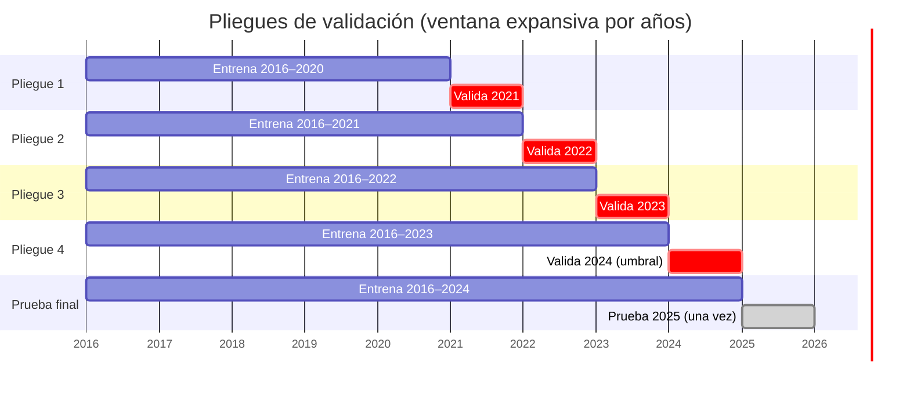
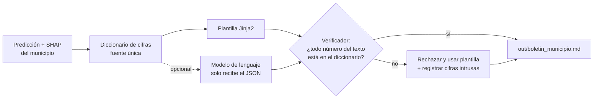

# Propuesta: SATMM Santander, alerta temprana de movimientos en masa

**Reto avanzado, Hackathon UDES.** Cada mes, un modelo estima la probabilidad de que cada uno de los 87 municipios de Santander registre al menos un movimiento en masa. Usa solo datos conocidos el día 1 del mes. Las alertas salen en un mapa con una explicación por municipio. Para el municipio en alerta se genera un boletín cuyas cifras se verifican automáticamente contra los datos.

## Entregables del reto y cómo los cubrimos

| # | Pide el reto | Nuestra respuesta | Dónde |
|---|---|---|---|
| 1 | Esquema de validación temporal propio y justificado | Ventana expansiva por años, 4 pliegues (2021–2024) y 2025 como prueba final intocable | [Validación](#validación-temporal) |
| 2 | Modelo y explicación de sus predicciones | XGBoost con peso de clase; SHAP global y por municipio, traducido a frases | [Modelo](#modelo) |
| 3 | Alertas en un mapa | Folium: polígonos del GeoJSON coloreados por semáforo, con la explicación en la ventana emergente | [Mapa](#mapa) |
| 4 | Boletín sin cifras inventadas | Plantilla llenada con un diccionario de cifras y un verificador que rechaza cualquier número que no esté en los datos | [Boletín](#boletín) |
| 5 | Qué no puede anticipar | Subregistro, lluvia mensual de la cabecera, detonantes no climáticos y escala | [Límites](#límites) |

## Variables

Objetivo: `hubo_mm` del mes *t*. Todas las variables usan información hasta el mes *t − 1*.

| Variable | Definición | Por qué |
|---|---|---|
| `lluvia_t1` | `lluvia_mm_mes_anterior` | Lluvia reciente |
| `lluvia_t2` | `lluvia_mm` desplazada 2 meses | Lluvia antecedente |
| `lluvia_2m` | `lluvia_t1 + lluvia_t2` | Suelo saturado; el plan B del enunciado genera el riesgo a partir de esto |
| `lluvia_anom` | `lluvia_t1` / promedio de `lluvia_t1` del mismo municipio y mes en años anteriores | Lluvia inusual para ese lugar |
| `mm_12m` | Movimientos en masa de los 12 meses anteriores (archivo base, `shift(1)`) | Susceptibilidad del terreno |
| `mm_hist_mes` | Tasa histórica de `hubo_mm` del municipio en ese mes calendario, solo años anteriores | Climatología local |
| `eventos_12m` | Del panel | Historial general |
| `altitud_m`, `latitud`, `longitud` | Cabecera | Relieve y región |
| `mes_sin`, `mes_cos` | `sin(2π·mes/12)`, `cos(2π·mes/12)` | Ciclo anual sin salto de diciembre a enero |
| `mes_sin2`, `mes_cos2` | `sin(4π·mes/12)`, `cos(4π·mes/12)` | Las dos temporadas de lluvia; `mes_sin2` es la variable más correlacionada (−0,19) |

**Excluidas a propósito:**
- `lluvia_mm` y `eventos_mes`: no se conocen el día 1 del mes (fuga de datos). En producción, `lluvia_mm` se reemplazaría por un pronóstico estacional del IDEAM.
- `municipio` como categoría: memorizaría el municipio en lugar de aprender del relieve y la lluvia.

## Validación temporal

**Justificación:**
- **Imita el uso real:** el sistema siempre predice el futuro con el pasado. Una partición aleatoria pondría meses de 2025 en el entrenamiento.
- **Un año completo por pliegue:** los meses de un mismo año comparten fenómenos como La Niña 2022. Partir dentro del año filtraría ese patrón.
- **Años secos y húmedos:** la tasa va de 5,4 % (2024) a 14,6 % (2022). Reportamos media y rango entre pliegues, no un solo número.
- **2015 se usa solo para rezagos:** sus variables de 12 meses están incompletas ([Datos, hallazgo 3](02_datos.md#hallazgos)).
- **Sin fuga en las climatologías:** `lluvia_anom` y `mm_hist_mes` usan solo años anteriores al de cada fila, así que valen igual en cualquier pliegue.
- **2025 se toca una sola vez,** al final, con el modelo y el umbral ya fijados.

## Modelo

| Modelo | Papel |
|---|---|
| Base A: repetir el mismo mes del año anterior | Línea base exigida en el reto medio; la mantenemos como referencia |
| Base B: `mm_hist_mes` como probabilidad | Climatología: "lo que suele pasar en este municipio y este mes" |
| Regresión logística (`log1p` en lluvias, estandarizada, `class_weight="balanced"`) | Modelo interpretable de referencia |
| **XGBoost sin peso de clase** (`max_depth` 2, 300 árboles) | Modelo principal. Sin peso para que la probabilidad publicada quede calibrada; el desbalance se maneja con el umbral |

**Métricas, en este orden:**
1. **PR-AUC:** resume el desempeño sin elegir umbral, y con 8 % de positivos es más honesta que el ROC-AUC.
2. **Sensibilidad (recall) y precisión** en el umbral elegido.
3. **Precisión en el top 10 por mes:** suponemos que el consejo departamental puede reforzar unos 10 municipios al mes. Es una cifra a confirmar.
4. **Brier score:** dice si la probabilidad está bien calibrada, que importa porque el boletín la publica.

**No usamos exactitud:** un modelo que nunca alerta acierta el 92 % de las veces.

**Prioridad: sensibilidad.** Un falso negativo es un municipio sin preparar con viviendas o una vía en riesgo; un falso positivo cuesta una visita preventiva. El umbral amarillo se elige en el pliegue 4 para lograr una sensibilidad de al menos 0,70, y después se congela. El rojo se limita a la capacidad de respuesta del consejo.

**Semáforo:**

| Nivel | Regla | Acción sugerida |
|---|---|---|
| Rojo | Entre los 10 más altos del mes **y** p ≥ umbral amarillo | Activar el consejo municipal, revisar taludes y vías |
| Amarillo | p ≥ umbral amarillo (sensibilidad ≥ 0,70 en 2024) | Vigilancia y comunicación preventiva |
| Verde | p < umbral amarillo | Preparación ordinaria |

**Resultado en 2025** (prueba final, evaluada una vez): PR-AUC 0,204 frente a 0,106 de la línea base A y 0,144 de la B. El semáforo detecta en rojo o amarillo el 84 % de los meses con movimiento en masa (la línea base A, el 11 %). Brier 0,082, es decir, probabilidad calibrada.

## Explicación

- **Global:** gráfico SHAP de resumen y gráfico de dependencia de `lluvia_2m`, para mostrar dónde empieza a subir el riesgo.
- **Por municipio:** las 3 variables con mayor valor SHAP positivo, convertidas en frases a partir de los valores reales. Por ejemplo: *"lluvia de los dos últimos meses: 412 mm (percentil 92 de su historia)"* o *"movimientos en masa en los últimos 12 meses: 3"*.
- **Comprobación de sentido común:** el riesgo debe subir con la lluvia y con el historial. Si SHAP muestra lo contrario, es señal de un error en las variables.

## Mapa

Folium con los polígonos de `santander_municipios.geojson` coloreados por semáforo. La ventana emergente muestra probabilidad, nivel, las 3 razones y un enlace al boletín. Un selector permite elegir el mes de 2025. Se genera `out/mapa_alertas.html`, que se abre en el navegador sin servidor.

## Boletín

- **El diccionario es la única fuente de cifras.** La plantilla no calcula nada: solo inserta valores.
- **El verificador** extrae con una expresión regular todos los números del texto (incluidos porcentajes, años y miles con punto) y comprueba que cada uno esté en el diccionario, con tolerancia de redondeo. Cualquier número intruso invalida el texto.
- **Prueba en vivo para el jurado:** se agrega a mano "350 viviendas" al boletín y el verificador lo rechaza.
- **Contenido:** municipio, mes, nivel, probabilidad, las 3 razones, historial del municipio (eventos y personas afectadas en los últimos 12 meses), acciones sugeridas según el nivel y las limitaciones en una línea.

## Límites

El sistema **no** puede anticipar:
1. **Lo que no se reporta.** El subregistro hace que municipios pequeños o aislados parezcan seguros. Los marcamos aparte: altitud alta, lluvia alta y pocos reportes.
2. **Aguaceros de pocas horas.** La lluvia es mensual y medida en la cabecera; no ve picos diarios ni la lluvia en veredas altas, que son las que detonan los deslizamientos.
3. **Dónde y cuándo exactamente.** Responde municipio y mes, no vereda ni día.
4. **Detonantes no climáticos:** sismos, cortes de talud por obras, deforestación y fugas de acueducto.
5. **Un mes inusual sin antecedentes:** la lluvia del mes en curso solo entraría con un pronóstico.
6. **Cambios en cómo se reporta,** por ejemplo una alcaldía que empieza a reportar más.

**Con lluvia diaria:** usaríamos máximos de 1, 3 y 7 días y lluvia antecedente con decaimiento exponencial, que son los indicadores físicos de los umbrales de deslizamiento. Eso permitiría alertas semanales en lugar de mensuales.

## Fuera de alcance

- Tablero web (Streamlit o Dash): el cuaderno y el HTML del mapa bastan para el jurado.
- Pronóstico de lluvia.
- Modelos espaciales, como el efecto de los municipios vecinos.
- Ajuste fino de hiperparámetros: con 87 municipios el riesgo de sobreajustar a un pliegue es mayor que la ganancia.
