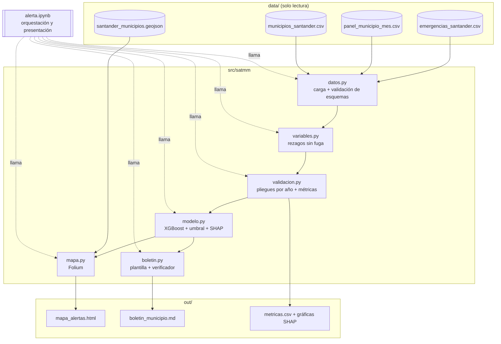
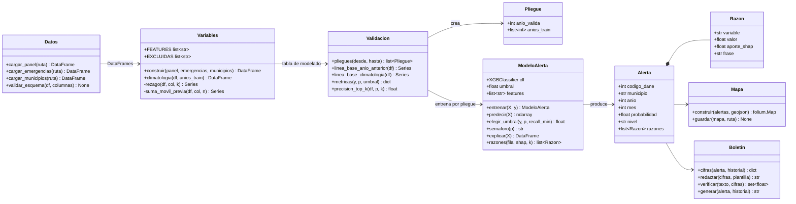
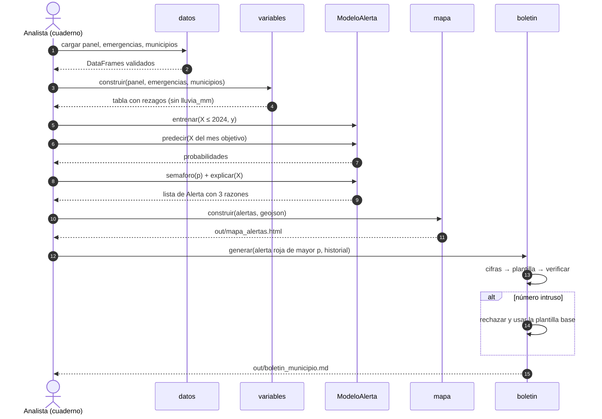
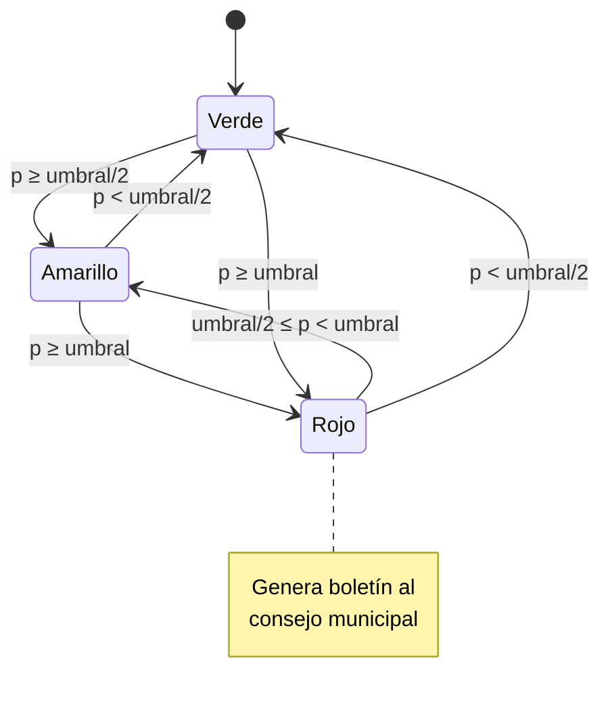

# Arquitectura

Trabajo local en VS Code, una sola persona escribe el código. Un cuaderno orquesta el flujo y presenta los resultados. La lógica que el jurado puede auditar vive en módulos pequeños de `src/satmm/`. Todo corre sin internet, salvo el fondo del mapa (tiles de OpenStreetMap) y el modelo de lenguaje opcional.

## Estructura del repositorio

```
simulacro hackaton/
├── data/                          # datos originales, solo lectura
│   ├── emergencias_santander.csv
│   ├── panel_municipio_mes.csv
│   ├── municipios_santander.csv
│   └── santander_municipios.geojson
├── docs/                          # esta documentación + enunciado PDF
├── src/satmm/
│   ├── datos.py                   # carga y validación de esquemas
│   ├── variables.py               # rezagos, climatología, mes cíclico
│   ├── validacion.py              # pliegues por año, métricas, líneas base
│   ├── modelo.py                  # entrenar, umbral, semáforo, SHAP
│   ├── mapa.py                    # Folium
│   └── boletin.py                 # plantilla + verificador
├── tests/test_boletin.py          # el verificador debe rechazar cifras inventadas
├── alerta.ipynb                   # orquestación y presentación
├── out/                           # mapa, boletines, gráficas (generado)
└── pyproject.toml                 # dependencias fijadas, Python 3.12
```

## Vista de componentes



## Diagrama de clases

Los módulos son funcionales. Las clases son contenedores de datos (`dataclass`), para que las firmas sean claras.



## Secuencia: correr la alerta de un mes



## Estados del semáforo



El estado se recalcula desde cero cada mes. El diagrama muestra transiciones posibles, no memoria entre meses.

## Decisiones de diseño

| Decisión | Alternativa descartada | Por qué |
|---|---|---|
| Cuaderno + módulos pequeños | Solo cuaderno | Los módulos permiten probar el verificador y mostrar código limpio al jurado; el cuaderno sigue siendo la presentación |
| XGBoost | Bosque aleatorio | Igual de rápido con este tamaño, maneja el desbalance con `scale_pos_weight` y tiene SHAP exacto con `TreeExplainer` |
| Folium + GeoJSON | GeoPandas + matplotlib | Mapa interactivo con ventanas emergentes, sin dependencias GDAL |
| Plantilla Jinja2 como base | Solo modelo de lenguaje | Funciona sin internet y es determinista; el modelo de lenguaje es opcional y pasa por el verificador |
| Unir por `codigo_dane` | Unir por nombre | Los nombres cambian (tildes, mayúsculas); el código no |
| Python 3.12 en `.venv` (uv) | Python 3.14 del sistema | shap depende de numba, que puede no tener versión para 3.14 |
