# Plan de implementación

105 minutos, una persona en el código. Horario supuesto: entrega a las 14:15 y cierre a las 16:00 del viernes 2 de octubre. Si el horario real es otro, se desplaza todo igual.

**Regla de oro:** a las 14:55 debe existir un resultado completo de punta a punta, con modelo simple, mapa y boletín, aunque sea feo. Desde ahí solo se mejora.

## Cronograma

```mermaid
gantt
    title Día del reto (105 min)
    dateFormat HH:mm
    axisFormat %H:%M
    section Base
    Entorno + carga y validación      :f0, 14:15, 10m
    Variables sin fuga               :f1, after f0, 15m
    section Primer resultado
    Logística + pliegues + líneas base :f2, after f1, 15m
    Mapa y boletín mínimos           :crit, f3, after f2, 10m
    Hito resultado completo          :milestone, m1, after f3, 0m
    section Mejora
    XGBoost + umbral + métricas 2025 :f4, after f3, 15m
    SHAP global y por municipio      :f5, after f4, 10m
    Mapa coroplético + boletín final :f6, after f5, 10m
    section Cierre
    Restart & Run All + límites      :crit, f7, after f6, 10m
    Ensayo de sustentación           :f8, after f7, 10m
```



## Fases

### F0 · Entorno y carga (14:15–14:25)

- [ ] `uv venv --python 3.12 .venv` e instalar dependencias; seleccionar el kernel en VS Code.
- [ ] `datos.py`: cargar los tres CSV, validar columnas y tipos, y confirmar que coinciden los 87 códigos DANE.
- [ ] Listar en el cuaderno los problemas encontrados ([Datos](02_datos.md#hallazgos)).

**Listo cuando:** `panel.shape == (11484, 10)` y no hay códigos huérfanos.

### F1 · Variables sin fuga (14:25–14:40)

- [ ] Ordenar por `codigo_dane, anio, mes`; rezagos con `groupby().shift()`.
- [ ] `lluvia_t2`, `lluvia_2m`, `mm_12m` (suma móvil desplazada), `mes_sin`, `mes_cos`, coordenadas.
- [ ] `lluvia_anom` y `mm_hist_mes` como funciones que reciben los años de entrenamiento.
- [ ] `assert` de que `lluvia_mm` y `eventos_mes` no están en `FEATURES`.

**Listo cuando:** la fila de enero de 2016 de un municipio cualquiera tiene `lluvia_t2` igual a la `lluvia_mm` de noviembre de 2015, verificado a mano.

### F2 · Pliegues y líneas base (14:40–14:55)

- [ ] `pliegues()`: 2021, 2022, 2023, 2024 para validar; entrenamiento desde 2016.
- [ ] Línea base A (mismo mes del año anterior) y B (climatología).
- [ ] Regresión logística con `class_weight="balanced"`.
- [ ] Tabla de PR-AUC, sensibilidad, precisión y Brier por pliegue.

### F3 · Resultado mínimo completo (14:55–15:05)

- [ ] Predicción de enero de 2025 con la logística.
- [ ] Mapa con `CircleMarker` por cabecera.
- [ ] Boletín con plantilla y verificador, más su prueba.

**Hito: resultado completo.** Si a las 15:05 esto no existe, se corta F5 y se mejora lo que hay.

### F4 · Modelo principal (15:05–15:20)

- [ ] XGBoost en los 4 pliegues; comparar con la logística y las líneas base.
- [ ] Umbral elegido en 2024 para una sensibilidad de al menos 0,70; congelarlo.
- [ ] Una sola evaluación en 2025: métricas, matriz de confusión y precisión en el top 10 por mes.

### F5 · Explicación (15:20–15:30)

- [ ] `shap.TreeExplainer`: gráfico de resumen y dependencia de `lluvia_2m`.
- [ ] `razones()`: las 3 variables que más empujan hacia arriba, en frases con valores reales.
- [ ] Comprobación de sentido común: el aporte de `lluvia_2m` debe crecer con la lluvia.

### F6 · Mapa y boletín finales (15:30–15:40)

- [ ] Coroplético con el GeoJSON y ventana emergente con las razones; guardar en `out/mapa_alertas.html`.
- [ ] Boletín del municipio en rojo con mayor probabilidad; verificador en verde.

### F7 · Cierre (15:40–15:50)

- [ ] *Restart & Run All* sin errores.
- [ ] Celda markdown con límites y con lo que decidimos no construir.
- [ ] Copia de `out/` en una USB, por si falla el portátil.

### F8 · Ensayo (15:50–16:00)

- [ ] Recorrer las [preguntas del jurado](05_sustentacion.md).
- [ ] Ubicar en el código las tres porciones más probables de que señale el jurado: rezagos, pliegues y verificador.

## Riesgos y respuesta

| Riesgo | Señal | Respuesta |
|---|---|---|
| shap no instala | Error de numba o llvmlite | Usar `xgb.Booster.predict(pred_contribs=True)`: da contribuciones SHAP exactas sin la librería shap |
| Sin internet para instalar | `uv` no descarga | Pedir en el evento una carpeta con wheels; si no hay, scikit-learn trae `HistGradientBoostingClassifier`, y la logística con coeficientes × valores sirve de explicación |
| XGBoost no supera a la línea base | PR-AUC igual o menor que la climatología | Reportarlo con honestidad; presentar la logística y decir qué variable falta |
| El mapa no carga tiles | Fondo gris | Polígonos sin fondo (`tiles=None`); siguen siendo legibles |
| Atraso | 15:05 sin resultado completo | Saltar F5 y explicar con los coeficientes de la logística |

## Dependencias

```
pandas numpy scikit-learn xgboost shap folium jinja2 matplotlib ipykernel pytest
```
